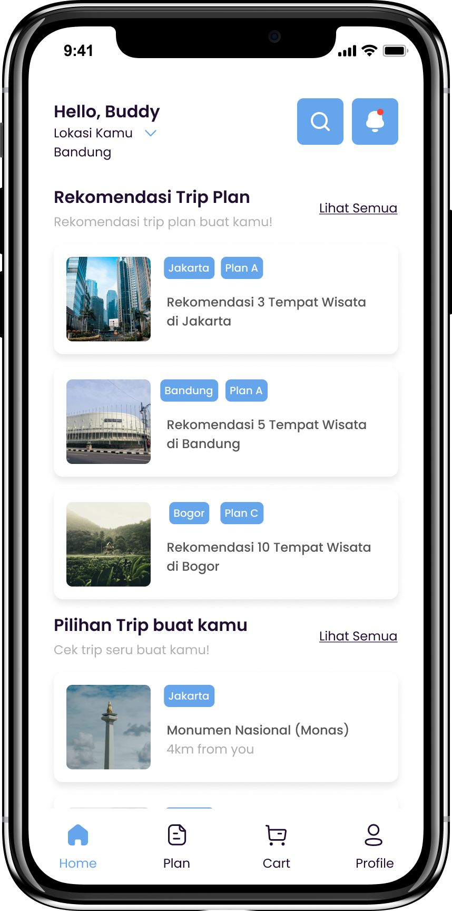
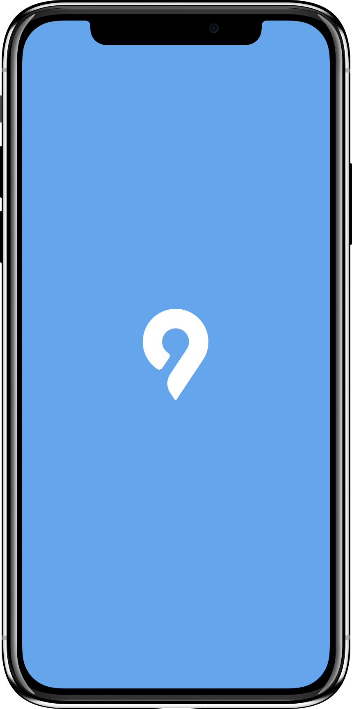
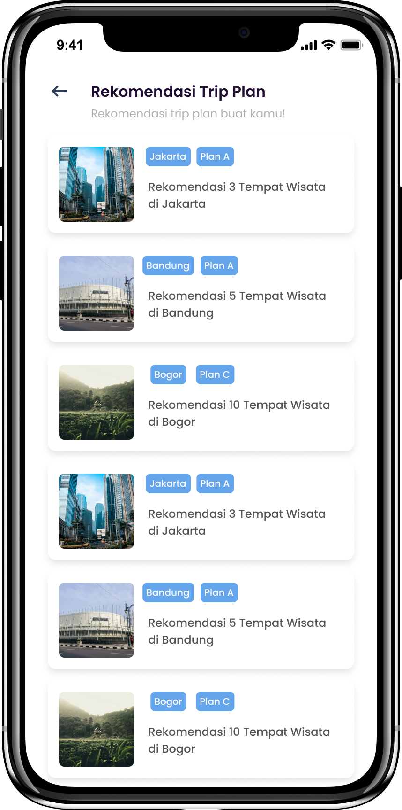

# Mobile Development

Using the [Kotlin programming language](https://kotlinlang.org/) to develop applications. Using [Retrofit](https://square.github.io/retrofit/) to handle all things related to data connection from android to the internet. Using [firebase](https://firebase.google.com) to store user data and to authenticate login and register systems. Using [Google Services](https://cloud.google.com) to get the user's current location

# App Development roadmap

In making the application we apply several processes where we make it into 2 processes, is a Implementation to Design,and Implementation to Applications

# Implementation to Design
we do the application design process using the web-based application [Figma](figma.com)

# Implentation to Apps
After the design process, continued with making applications using android studio and the [Kotlin programming language](https://kotlinlang.org/), we implemented the UI Design from what had been made previously processed to be realized into an application, then we provide several features such as Using [Retrofit](https://square.github.io/retrofit/) to handle all things related to data connection from android to the internet. Using [firebase](https://firebase.google.com) to store user data and to authenticate login and register systems. Using [Google Services](https://cloud.google.com) to get the user's current location

# Preview Mobile Apps

	 &nbsp; &nbsp; &nbsp;
		 &nbsp; &nbsp; &nbsp;
	

